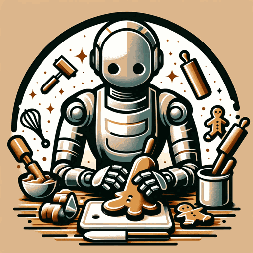

# Infinite Art

Infinite Art uses an image diffusion model (Dall-E api currently) to recursively generate variations of images. It can sometimes get stuck in local minimum (of famous people, characters or symbols), so occasionally bits of random noise are added if the images stay too similar.

### TODO

There needs to be a way to bring your own openai key that is secure. Or I need to use a free diffusion model that can do create variation.